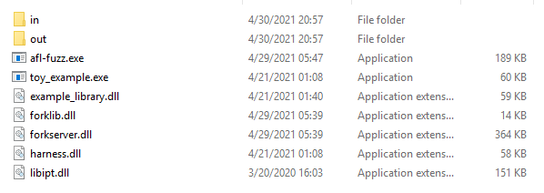

# Walkthrough: Fuzzing an example program with Winnie

In this guide, I'll explain how to use Winnie to fuzz a toy example program. The code for this guide can be found in `samples/toy_example`. You can build it with Visual Studio. There are 3 projects in the solution:

 - toy_example: this builds the main .exe we will fuzz
 - example_library: this is a .dll containing some buggy functionality that we want to target with our fuzzer
 - harness: this provides a bare-bones example harness to use with Winnie.

To set up the fuzzer, copy the target application (toy_example.exe and example_library.dll) to the Winnie directory (so it's next to afl-fuzz.exe). AFL needs seed inputs, so copy the seed input file (in\input). Lastly, Winnie needs a fuzzing harness to call the target, so copy our fuzzing harness `harness.dll` next to afl-fuzz.exe as well.

At this point, your directory structure should look like this:

Winnie collects coverage using *full-speed* instrumentation. Full-speed instrumentation essentially puts a breakpoint on each basic block. Thus, Winnie needs a list of the addresses of basic blocks we want to cover per module. This list is called the *bb-file* and it's specified with the `-bbfile` parameter. We can automatically generate this file with the IDAPython script `scripts/ida_basic_blocks.py` if you have IDA Pro. (There is also a script for Ghidra.) For more about the bbfile file format, check the README.

At this point, you should also have `basicblocks.bb` in the directory too. Now we can start fuzzing.

`afl-fuzz -i in -o out -t 1000 -I 1000 -- -bbfile basicblocks.bb -- -harness harness.dll -no_minidumps -- toy_example.exe @@`

**Breakdown of the command-line:**

1. `afl-fuzz -i in -o out -t 1000 -I 1000` Standard AFL parameters `-i` and `-o` for input/output dirs, execution timeout (`-t`) of 1000ms, initialization timeout (`-I`) of 1000ms.

2. `--` End of AFL options and start of fullspeed instrumentation options

3. `-bbfile basicblocks.bb` (Required) Use the basic blocks specified in the bbfile `basicblocks.bb`.

4. `--` End of the fullspeed options and start of the forkserver options

5. `-harness harness.dll` (Required) Use our fuzzing harness specific to toy_example.

6. `-no_minidumps` Disable minidumps for speed since toy_example tends to crash a lot during fuzzing. See README for more info.

7. `--` End of forkserver options and start of target argv

8. `toy_example.exe @@` Call toy_example.exe and pass the input filename as argv[1].

### Troubleshooting 

If you encounter errors, check out the README for more info on debugging or make an issue.
